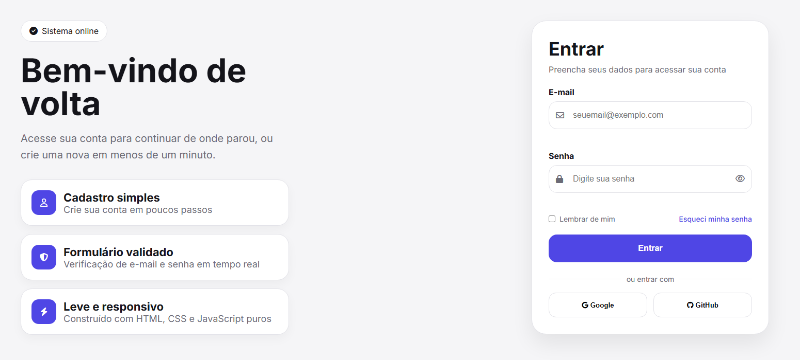

# LoginPage

Tela de login que fiz para treinar front-end puro: só **HTML5, CSS3 e JavaScript**, sem framework, sem build tool, sem dependência de back-end. A ideia foi simular uma experiência de login completa (validação, feedback visual, estado de carregamento) do jeito que ela apareceria num produto real.



## O que tem na tela

- Layout dividido em duas colunas: um lado apresenta o produto, o outro é o formulário de acesso
- Validação de e-mail e senha em tempo real, com mensagens de erro específicas para cada caso
- Botão de mostrar/ocultar senha
- Botão de "Entrar" com estado de carregamento (spinner) e um toast de confirmação ao final
- Layout responsivo — em telas menores, o painel de apresentação e o formulário empilham em uma coluna só
- Sem back-end de verdade: o "login" é simulado no JavaScript só para demonstrar o fluxo

## Tecnologias

- HTML5 semântico
- CSS3 (Grid, Flexbox, variáveis CSS, transições)
- JavaScript puro (DOM, eventos, regex para validação)
- [Font Awesome](https://fontawesome.com/) para os ícones
- [Google Fonts – Inter](https://fonts.google.com/specimen/Inter) para a tipografia

## Como rodar

Não precisa instalar nada. Basta abrir o `index.html` no navegador, ou, se preferir servir localmente:

```bash
npx serve .
```

ou, com Python:

```bash
python -m http.server 8000
```

e acessar `http://localhost:8000`.

## Estrutura do projeto

```
LoginPage/
├── index.html
├── style.css
├── script.js
└── assets/
    ├── background.jpg
    ├── icon_html.png
    └── preview.png
```

## Por que esse projeto

Fiz essa tela como exercício de UI e para ter algo no portfólio que mostrasse atenção a detalhe: estados de foco acessíveis, feedback de erro claro, microinterações (hover, loading, toast) e um layout que se sustenta sozinho sem depender de framework nenhum. Ainda pretendo evoluir com um modo escuro e talvez uma versão com cadastro completo.

## Autor

Feito por **Franklin** — front-end developer.
Fico à disposição para trocar ideia, sugestões e feedback são bem-vindos.
